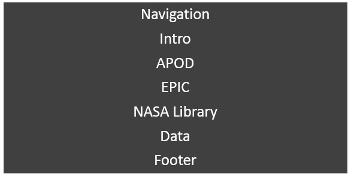
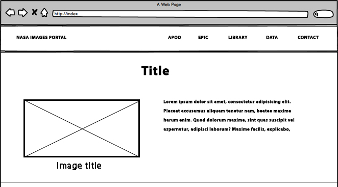

# Single Page Application using the NASA API

GitHub Pages: https://sonnerz.github.io/project02-interactive-frontend/ <br>


**Create a Single Page Application that relies heavily on one or more APIs**

Provide search results in a manner that is visually appealing for your user (by drawing on the skills you have learned in User-Centric Frontend Development

## Guidelines and Guideline fulfilment

1.	**Create a Single-Page Application (SPA)**<br>
I have created a Single-Page Application (SPA) divided into six distinctive sections
2.	**Incorporate links or buttons to allow your user to navigate the site and reset/control the site functionality**<br>
I have provided a ‘sticky’ navbar at the top of the web page. This means that navigation is always available to the site user. Buttons to search and clear API results are also provided in the content sections.
3.	**Whenever possible, strive to use semantic HTML5 elements to structure your HTML code better.**<br>
Semantic HTML5 elements are used throughout to structure the html.
4.	**Make sure your site is as responsive as possible. You can test this by checking the site on different screen sizes and browsers. 
Please note that if you are building a data dashboard, only your chart containers are expected to be responsive. Charts using D3.js are not responsive as they are designed for desktop or large-screen viewing.**<br>
The site has been built to be as responsive as possible. Please see the [Testing](#testing) section for further details.
5.	**We advise that you write down user stories and create wireframes/mock-ups before embarking on full-blown development.**<br>
User stories and wireframes are provided in the [Scenarios](#scenarios) section and the [Wireframes](#wireframes) section.
6.	**The site can also make use of CSS frameworks such as Bootstrap, just make sure you maintain a clear separation between the library code and your code.**<br>
The page is created using HTML5 and CSS3, provided by the Bootstrap Framework 4. 
7.	**You should conduct and document tests to ensure that all of your website’s functionality works well.**<br>
Testing was under taken and recorded in the [Testing](#testing) section below
8.	**Write a README.md file for your project that <br>
a.	explains what the project does and <br>
b.	the need that it fulfils.<br>
c.	It should also describe the functionality of the project, <br>
d.	as well as the technologies used.<br> 
e.	Detail how the project was deployed <br>
f.	and tested and <br>
g.	if some of the work was based on other code, explain what was kept and how it was changed to fit your need. <br>
A project submitted without a README.md file will FAIL.**<br>
I hope this ReadMe.md file meets all the criteria listed above.
9.	**Use Git & GitHub for version control. Each new piece of functionality should be in a separate commit.**<br>
Git was used for version control and my logs clearly show that a commit was made after each new piece of functionality was added and/or an issue was resolved. See [Version Control](#version) section below.
10.	**Deploy the final version of your code to a hosting platform such as GitHub Pages.**<br>
GitHub Pages was used to host the final SPA. See [Deployment](#deployment) section below.


<hr><hr>
<a name="topofpage"></a>

# Table of Contents

*   [Strategy Plane](#strategy)
    *   [Define roles and responsibilities](#randr)
    *   [Project Charter](#charter)
    *   [Website development Roadmap](#roadmap)
    *   [Strategy Trade-off](#trade)
    *   [Defensive Design](#def)
*   [Scope Plane](#scope)
    *   [Note about FETCH](#fetchnote)
    *   [Scenarios](#scenarios)
    *   [Functional Specifications](#func)
    *   [Content Requirements](#content)
        *   [Page Structure](#pagemap)
        *   [Navigation systems](#nav)
*   [Structure & Skeleton Plane](#sands)
    *   [Information architecture](#architecture)
*   [Wireframes](#wireframes)
    *   Index Page
    *   APOD
    *   EPIC
    *   Library
*   [Surface Plane](#surface)
    *   [Development Phase](#dev)
        *   [IDE](#ide)
        *   [Version Control](#version)
        *   [Readme](#readmeheader)
        *   [HTML/CSS Structure](#html)
            *   Navigation
            *   Footer
        *   [Content Sections](#contsect)
            *   Welcome Section
            *   APOD – Astronomy Picture of the Day
            *   EPIC
            *   Library – Search NASA Image and Video Library
            *   Data
            *   Colours
        *   [SCSS/CSS](#scss)
        *   [JavaScript](#javascript)
            *   [nasaAPI-apod.js](#jsapod)
            *   [nasaAPI-epic.js](#jsepic)
            *   [nasaAPI-library.js](#jslibrary)
            *   [nasaAPI-data.js](#jsdata)
            *   [helperTools.js](#jshelper)
    *   [Testing](#testing)
        *   [Development/Defensive Design Testing](#devtesting)
        *   [Ongoing Testing](#ongoing)
            *   [Issues and Solutions](#issues)   
        *   [Usability Testing](#usability)
        *   [Final Testing](#final)
*  [Deployment](#deployment)
*  [Credits](#external)


<a name="strategy"></a>
# Strategy Plane
The overall aim of the project was to create a single page application website (SPA) that utilises the NASA API. A selection of API calls was made to illustrate the type of data NASA makes available to the public. The scope is fundamentally determined by the strategy of the site, so it was important we define a good strategy from the outset. This strategy outlines the benefit to the users. We aimed to: 
* determine the value of the website and
* the reason for the websites existence

<a name="randr"></a>
## Define roles and responsibilities
From here on the **single page application website** will be known as the **SPA**.
For the purposes of this project, Sonya Cooley had full authority, primary responsibility, and full accountability for all aspects of the project. 
She had a Mentor available to her throughout the development of the SPA.

[Top of page](#topofpage)
<a name="charter"></a>
## Project Charter 
||Objectives |
|:---|:---|
|**Purpose:** What purpose does the website serve?|The SPA will target users interested in NASA, the type of work they do and the topic of Space in general.Casual users may be interested in the images made available by NASA.|
|**Goals:** What outcomes does it need to achieve?|<ul><li>Successfully access the NASA API</li><li>Publish the data NASA has made available in an interesting and user-friendly way</li></ul>
|**Target audience:** Whom must the product appeal to and work for?|NASA enthusiasts and casual site visitors looking for interesting and easy to understand data.|
|**Success indicators:** How will you know you have achieved project goals?|<ul><li>Data is successfully returned from the API</li><li>Visitors regularly revisit to view new data and new visitor numbers increase</li></ul>|
|**Strategies:** What approaches will help to realise the goals?|<ul><li>We will take a mobile first approach to Content. </li><li>Focus content at our target audience</li><li>Aim to keep the site simple and not over complicated</li><li>Present NASA data in an interesting and user-friendly way</li></ul>
|**Tactics:** What activities might help to realise the strategies?|<ul><li>Provide a user experience that is accessible and enjoyable for all visitors</li><ul><li>following conventions and industry standards for design and interaction</li><li>providing clear and consistent navigation</li><li>testing usability with a wide range of clients and industry standard tools</li></ul></ul>

[Top of page](#topofpage)
<a name="roadmap"></a>
### Website development Roadmap
The UXD will be driven by the API data and user needs.
|**Define**|NASA API analysis, Requirements gathering, SEO, Social Media, Content Strategy – Personas, Content inventory returned from API.|
|:---|:---|
|**Design**|Information architecture, Functional & technical requirements, Navigation design, Wireframes, UX/UI, Pages, Branding, style guides, mock-ups.|
|**Develop**|Look & feel, Design and Development, Build, Version control, Testing, Deploy|

[Top of page](#topofpage) 

<a name="trade"></a>
### Strategy Trade-off
|Opportunity/Problem|Importance|Viability/Feasibility|
|:---|:---|:---|
|Create Online Presence|5|5|
|Increase visitor numbers|4|4|
|Present all NASA data via API|5|1|
|Present select data|5|4|
|APDO|5|5|
|EPIC images|5|4|
|Search Images Library|4|4|
|NEO WS|3|3|
|Mini Dashboard|3|4|

|Graph|Opportunity Feasible?|
|:---|:---|
||Feasible for initial release <ul><li>Create Online Presence</li><li>Increase visitor numbers</li><li>Present Select Data</li></ul>Features for future releases<ul><li>Present all NASA data via API</li><li>NEO WS</li></ul>

[Top of page](#topofpage)
<a name="def"></a>
## Defensive Design
Defensive design for the Web usually focuses on the most common points of failure: forms, search, the address bar and server problems
* it employs validation to check for mistakes before they frustrate the site user,
* it expands available options based on the user’s implied intent,
* it protects site visitors from server errors and broken links with informative messages and
* it assists the user before mistakes happen.

For this SPA all API calls in the JS files will have a message to users if the connection to the API fails for any reason.
Users will be told there was a network/connection error and to try again later.

If users fail to enter text or a date for inputs fields before clicking a search button, they will be informed that text/date are required.

If users query text fails to return any search results, users will be informed that there were no results for that search query.


[Top of page](#topofpage)
<a name="scope"></a>
# Scope Plane
Our project scope was based on our defined Strategy. We;
* determined the SPA requirements
* determined the SPA key functionality and
* determined what features were to be included in this and possible future product releases

The SPA targeted NASA enthusiasts and casual visitors with NASA data. The site accesses API data and publishes to the SPA. A combination of images, tables, and HTML5 was used to make the data useful and interesting. Semantic HTML was used throughout and the site is responsive to a broad range of devices.

[Top of page](#topofpage)

<a name="fetchnote"></a>
## Note about FETCH
**Coding**<br>
The JavaScript was optimised for Chrome. A combination of AJAX, FETCH and XMLHttpRequest were used to make the API calls. 
These were used to illustrate flexibility as a coder.
The downside of this means that the FETCH API call does **not** work in Internet Explorer.

**Fetch**<br>
<a href="https://developer.mozilla.org/en-US/docs/Web/API/Fetch_API">https://developer.mozilla.org/en-US/docs/Web/API/Fetch_API</a>

**Desktop**

|Feature|Chrome|Edge|Firefox(Gecko)|IE|Opera|Safari(WebKit)|
|:---|:---|:---|:---|:---|:---|:---|
|Basic support|42|14|39 (39) 34[1] <br>52(52)[2]|No support|29 28[1]|10.1
|ReadableStream response body|43|14|No support[3]|No support|?|No support|


**Mobile**

|Feature|Android Webview|Chrome for Android|Edge|Edge Firefox Mobile (Gecko)|IE Phone|Opera Mobile|Safari Mobile|
|:---|:---|:---|:---|:---|:---|:---|:---|
|Basic support|42|42|Yes|Yes|No support|No support|10.1|
|ReadableStream response body|43|43|Yes|No support[3]|No support|?|No support|

[Top of page](#topofpage)
<a name="scenarios"></a>
## Scenarios
###    NASA enthusiast:
A NASA enthusiast will be a visitor who is aware of NASA. They will be aware of the NASA organisation, the type of work they do and the type of data that is made available.
An enthusiast will visit the site with an expectation of being able to view NASA data and search the data for topics/images of interest to them. The enthusiast will most likely use the Search NASA images library.

###    Casual visitor:
A casual visitor will visit the site possibly out of curiosity to see what data is available. They will revisit if the data is presented in a favourable way. Images are a great way to introduce visitors to NASA data without overwhelming them with complex data.

###    Student:
A student may visit the site to access NASA images and videos. They may also have a specific interest in the EPIC project.

[Top of page](#topofpage)

<a name="func"></a>
## Functional Specifications

The site will provide visitors with access to the NASA data made available via its API.
The site will provide the ability to;
* navigate content
* view NASA API data
  * APOD - Astronomy Picture of the Day 
  * EPIC - Earth Polychromatic Imaging Camera (EPIC) images – the visitor will input a date and select an image type. This API returns up to 12 images and information on each image.
EPIC takes an image of earth every 2 hours approx.
  * Search the NASA Images and Video Library – the visitor will input a text query and select whether to search for images, audio or video. The API returns the results in pages of 100 items.
  * Data – a select NASA dataset will be used to chart and illustrate the type of data available from NASA.
* Welcome area and Footer area with further information

The SPA will be optimised for latest version of Chrome, Firefox, Internet Explorer, Safari and Opera and optimised for mobile usage. HTML and CSS will be written using the Mobile-First approach. The mobile-first approach is designing for the smallest screen and working your way up to desktop.

**Note:** Please note that the EPIC data will not be available in Internet Explorer due to the use of FETCH.

### Future Updates
1)  Reduce the number of Library image results displayed per page. This section is currently most suited to a desktop/laptop computer.
Due to the large number of results returned this section is not as mobile device friendly. This future update would increase the number of results pages but reduce the number of results displayed per page.
2)  Introduce the ability for users to display different numbers of results per page in the Library section - e.g. 20 results per page/50 results per page, etc.


[Top of page](#topofpage)
<a name="content"></a>
##    Content Requirements
The SPA will follow a standard format, with a structure based on a Bootstrap 4 theme. 
The page will have a sticky navbar always available to visitors and an intro section briefly explaining each section. 
The first content section will be a welcome to visitors and a brief explanation about each content section.
The next content section will publish the Astronomy Picture of the Day (APOD).
The third content section provides images captured by the EPIC project.
The fourth content section will allow users search the NASA Images and Video library. 
The footer will contain links to various NASA sites providing further information on the content sections.
  
All pages will be created using HTML5 and CSS3, provided by the Bootstrap Framework 4.

<a name="pagemap"></a>
### Page structure



The SPA will consist of a hero image in the intro section, a navigation bar and a footer with links to other information.
The navigation will allow users to navigate up and down the page.
The content sections will provide APOD, EPIC images and a search facility.

<a name="nav"></a>
### Navigation systems
‘Sticky’ navbar. <br>
The navbar will be always be available to users at the top of the page regardless of which content section a visitor is viewing.

|Description|Response|
|:---|:---|
|NASA Images Portal|Takes the user to the welcome-intro section|
|APOD|Takes the user to the Astronomy Picture of the Day section|
|EPIC|Takes the user to the DSCOVR's Earth Polychromatic Imaging Camera (EPIC) section|
|Library|Takes the user to the search facility that allows visitors to search the NASA image and video library|
|Data|The Data section shows a mini dashboard of NASA data|
|Contact-Information|Shows where to get further information about NASA, social media, etc.|


[Top of page](#topofpage)
<a name="sands"></a>
#  Structure & Skeleton Plane
Our goal for the Structure plane is to organise the information architecture and interactions for the site. We will keep a consistent, predictable, learnable interface, and, interactions. We will use industry standard technologies to implement expected behaviours when using the site, e.g. tooltips, navigation, including accessibility, etc.
Users will find the navigation at the top of the site in an expected location. The site will be intuitive and follow tried and trusted paths.
The input fields will follow user expectations where feedback is provided if user interactions are unexpected, incomplete or complete.

<a name="architecture"></a>
## Information architecture
The SPA will implement content in a single page. Each content section will be clearly labelled and be visually different from the previous content section. Making it obvious to visitors that they are in a different content section.
The site directories and files will be organised in the following way;

||At the root of the site:<ul><li>Index.html</li><li>ReadMe.md</li></ul>Assets Directory<ul><li>CSS sub-directory</li><li>Images sub-directory</li><li>JS sub-directory</li></ul>SCSS Directory<ul><li>scss files for css</li></ul>|
|:---|:---|


[Top of page](#topofpage)
<a name="wireframes"></a>
#  Wireframes

## APOD<a name="apodwf"></a>

## EPIC<a name="epicwf"></a>

## Library<a name="librarywf"></a>


[Top of page](#topofpage)
<a name="surface"></a>
#  Surface Plane

<a name="dev"></a>
## Development Phase

<a name="ide"></a>
### IDE
The website was developed using the Cloud9 IDE. 
Cloud9 IDE is an online integrated development environment, that supports hundreds of programming languages. It enables developers to get started with coding immediately with pre-configured workspaces, collaborate with their peers with collaborative coding features, and web development features like live preview and browser compatibility testing.

<a name="version"></a>
### Version Control
Git was used to manage the source code for this project. Git is a version control system for tracking changes in project files.
Project files were committed to Git after each major functional addition, update or implementation of testing results.
Following the initial commit to Git, each major update was followed by a Git add and commit. 
**A full Git log can be provided on request or be seen on the GitHub project repository.**

<a name="readmeheader"></a>
### Readme
A Readme markdown file is provided with the site on GitHub. It explains what the project does and the need that it fulfils. 
It also describes the functionality of the site, as well as the technologies used. 

The Readme provides information on how the site was deployed and tested and if some of the work was based on other code.


[Top of page](#topofpage)
<a name="html"></a>
### HTML/CSS Structure
**Navigation**


The navigation is responsive to the type of client device a user is using to view the site.
Any view below 992px wide will get a collapsing Navigation Bar. The navigation links will have a hover state making it obvious to users which navigation link they are hovering over. The text will turn the official NASA blue: #0B3D91

The collapsed navigation will have a similar hover state.

**Footer**


The footer was developed/designed to be full width and contain links to NASA sites including their social media.

[Top of page](#topofpage)

<a name="contsect"></a>
#### Content Sections
The SPA consists of one page – index.html. The page was created using Bootstrap 4. A hero image of Atlantis is the first image users see when they visit the site. The image is owned by the web developer.
The page is divided into six distinct areas, each with its own purpose; welcome, apod, epic, library, data, contact.

##### Welcome section
The welcome section welcomes the visitor to the site, it invites the visitor to use each section and briefly explains the purpose of that section. 
It will be a < header > with a large background image and text in a < p >. 

##### APOD – Astronomy Picture of the Day
APOD, makes a call to the APOD API returning the NASA chosen image/video of the day and a brief explanation provided by a professional astronomer.
The HTML < section > has a title and explanation row filling the width of the page. The image and text are displayed in two columns. If the APOD is a video, it will take up one row while its text will take up another row below the video.
See the [APOD](#apodwf) Wireframe


##### EPIC
The visitor has the option to view the most recent EPIC image received or chose a date and image type and send that date and image type to the EPIC API. The API returns images taken by the EPIC camera on that date. The list of images is paged, one image per page.

If the visitor chooses to view the most recent EPIC image then only one image is returned. It will be the last image received form DSCOVR on the previous day.

EPIC is a HTML < section >. The search part is in a div containing descriptive text, an input field for choosing a date, radio choices for natural/enhanced image and a search button.
When the user clicks the Search button, a < div > displays showing the results in two columns. The image in the left column and its text in the right column. Paging buttons also appear with the API results.
The most recent image API call displays the result in the same way as the Date search option.

See the [EPIC](#epicwf) Wireframe

##### Library – Search NASA Image and Video Library
The first part of the library < section > takes a text query and media type chosen by the site visitor and sends that query and media type to the library API. The API returns results in lots of 100 items. The user can page through the results.

After the user clicks the Search Button, a div for results appears below the search input area. It shows rows of the search results. Each result has an image in the left column while the text appears in the right column. 
Paging buttons are at the top of the results section.

See the [Library](#librarywf) Wireframe


##### Data
The NASA Facilities dataset is made available by NASA as a json file. This section takes the data and using dc/d3/crossfilter renders pie charts and bar charts.

##### Colours

NASA red and blue were sourced from https://en.wikipedia.org/wiki/NASA_insignia
or https://brandcolors.net/
|Hex|rgba||
|:---|:---|:---|
|#050215|rgba(5, 2, 21)|Blue|
|#0B3D91|rgba(11, 61, 145)|NASA Blue|
|#FC3D21|rgba(252, 61, 33)|NASA Red|

[Top of page](#topofpage)

<a name="scss"></a>
#### SCSS/CSS
Bootstrap 4 provides the fundamental CSS and JavaScript for the entire site.
However, custom styles have been created and a mainStyles.css file can be found in the assets/css directory.
Custom styles for each content section, and navigation are in their own SCSS file.
mainStyles.css is created from SCSS files. 

|SCSS||
|:---|:---|
|apod.scss|bootstrap-overrides.scss
|data.scss|epic.scss
|Global.scss|intro.scss
|library.scss|mainStyles.scss
|mixins.scss|navbar.scss
|variables.scss|

[Top of page](#topofpage)

<a name="javascript"></a>
### JavaScript

A JavaScript file has been created for each content section. Each section has its own API call.
NASA prefers that developers sign up for a developer key. This key is used in every API call.

* [nasaAPI-apod.js](#jsapod)
* [nasaAPI-epic.js](#jsepic)
* [nasaAPI-library.js](#library)
* [nasaAPI-data.js](#jsdata)
* [helperTools.js](#jshelper)	

<hr>

<a name="jsapod"></a>
#### APOD: 	nasaAPI-apod.js
This API call uses AJAX.

|Returned from API: | |
|:---|:---|
|<ul><li>copyright</li><li>date</li><li>explanation</li><li>hdurl</li><li>media_type</li><li>service_version</li><li>title</li><li>url</li></ul>||


```javascript
var url = "https://api.nasa.gov/planetary/apod?api_key=pyZKDq8cb4x1dJi0dsodTT9PBoWkQaa5CgxmPAxZ";
$.ajax({
    url: url,
    success: function(result) {
...      
});
```

The url provided by NASA takes an API key. An AJAX call is made using the url and the results are written out to the HTML page.

[Top of page](#topofpage)

<hr>

<a name="jsepic"></a>
#### EPIC:	nasaAPI-epic.js
This API call uses FETCH.<br>
<span style="color:red">This content section will not work in Internet Explorer. FETCH is not supported by IE.</span>

|Returned from API:  | |
|:---|:---|
|<ul><li>attitude_quaternions</li><li>caption</li><li>centroid_coordinates</li><li>coords</li><li>date</li><li>dscovr_j2000_position</li><li>identifier</li><li>image</li><li>lunar_j2000_position</li><li>sun_j2000_position</li><li>version</li></ul>||


Urls required by the API for each type of image:
|Image Type|URL|
|:---|:---|
|enhanced|https://api.nasa.gov/EPIC/api/enhanced/date/Date?api_key=pyZKDq8cb4x1dJi0dsodTT9PBoWkQaa5CgxmPAxZ|
|natural|https://api.nasa.gov/EPIC/api/natural/date/Date?api_key=pyZKDq8cb4x1dJi0dsodTT9PBoWkQaa5CgxmPAxZ|


|Function|Explanation|
|:---|:---|
|getEpicImageByDate()|<ul><li>Function called from Search button on the HTML page.</li><li> Date and image type taken from visitor input form </li><li> If image type is **enhanced** then a call is made to EPIC API using **FETCH** and enhanced url. A JSON Object is returned and parsed.</li><li> If image type is **natural** then a call is made to EPIC API using **FETCH** and natural url. A JSON Object is returned and parsed. </li><li> The JSON object is sent to *pageTheResult(*) for slicing into 1 item per page. 1 array item per page.</li><li> The sliced array is sent to *getResultItems()* for looping and rendering to HTML</li></ul>|
|getResultItems()|Data items from API result are rendered to HTML in a forEach loop|
|pageTheResult()|Paging the JSON Object to one item per page using JavaScript Array slice() Method|
|getNumberOfPages()|Retrieve the total number of items returned from API|
|nextPage()|Function called from clicking the paging **Next** Button|
|previousPage()|Function called from clicking the paging **Previous** Button|
|firstPage()|Function called from clicking the paging **First** Button|
|lastPage()|Function called from clicking the paging **Last** Button|
|check()|Enables/Disables paging buttons if necessary e.g. first button enabled then previous button disabled|
|getMostRecentEpic()|This function retrieves the most recent date of natural colour imagery and displays the last image in the array.|

[Top of page](#topofpage)

<a name="jslibrary"></a>
#### Library:	nasaAPI-library.js
This API call uses XMLHttpRequest.

|Object returned from API: | |
|:---|:---|
|<ul><li>href</li><li>caption</li><li>items</li><li>links (only if > 100 items returned)</li><li>metadata</li><li>version</li></ul>||
|The data array inside the items array||


API documentation provided by NASA: <br>https://images.nasa.gov/docs/images.nasa.gov_api_docs.pdf<br>

Search URL required by API:
https://images-api.nasa.gov/search?q={q}


|Function|Explanation|
|:---|:---|
|getQueryText()|<ul><li>Function called from Search button on the HTML page.</li><li>Query text and media type taken from visitor input form </li><li>The url is build using query text and media type</li><li>The url is sent to *searchNASALibrary()*</li></ul>|
|searchNASALibrary()|<ul><li>Call made to NASA Library API using *XMLHttpRequest()*</li><li>If result is **image** then the JSON object and media type is sent to *getLibraryResultsDataImage()*</li><li>If result is **audio** then the JSON object and media type is sent to *getLibraryResultsDataAudio()*</li><li>If result is **video** then the JSON object and media type is sent to *getLibraryResultsDataVideo()*</li><li>Each media type required different html rendering hence the 3 different functions</li></ul>|
|getLibraryResultsDataImage()|<ul><li>Processes image results and renders HTML</li><li>A popover is used to view the full description provided in the Results</li><li>A Paging url returned in the results is used to make the next page call to the API for the next 100 items</li></ul>|
|getLibraryResultsDataAudio()|<ul><li>Processes audio results and renders HTML</li><li>A popover is used to view the full description provided in the Results</li><li>A Paging url returned in the results is used to make the next page call to the API for the next 100 items</li></ul>|
|getLibraryResultsDataVideo()|<ul><li>Processes video results and renders HTML</li><li>A popover is used to view the full description provided in the Results</li><li>A Paging url returned in the results is used to make the next page call to the API for the next 100 items</li></ul>|
|Next Button|When the next button is clicked, a click function is evoked to increment the current page by one and call the API again for the next 100 items: *searchNASALibrary()*|
|Previous Button|When the previous button is clicked, a click function is evoked to decrement the current page by one and call the API again for the previous 100 items: *searchNASALibrary()*|
|First Button|When the first button is clicked, a click function is evoked to set the current page to one and call the API again for the first 100 items: *searchNASALibrary()*|
|Last Button|When the last button is clicked, a click function is evoked to set the current page to the last page and call the API again for the last 100 items: *searchNASALibrary()*|
|checkLibraryResultButtons()|Enables/Disables paging buttons if necessary e.g. first button enabled then previous button disabled|

[Top of page](#topofpage)

<a name="jsdata"></a>
#### Data:	nasaAPI-data.js
This API call uses Queue().

https://data.nasa.gov/resource/9g7e-7hzz.json

|Function|Explanation|
|:---|:---|
|show_city()|Plucks ‘center’ from the JSON and renders a pie chart illustrating the number of facilities in each city|
|show_status_pie()|Plucks ‘status’ from the JSON and renders a pie chart illustrating the status of the facilities: active, inactive, etc|
|show_center()|Plucks ‘city’ from the JSON and renders a bar chart illustrating the number of the facilities in each center|
|how_status()|Plucks ‘status’ from the JSON and renders a bar chart illustrating the status of the facilities in each center|

[Top of page](#topofpage)

<a name="jshelper"></a>
#### helperTools.js
Common functions used across all the js files

|Function|Explanation|
|:---|:---|
|splitDate()|<ul><li>This function takes two arguments: varDate (date), monthName (Boolean)</li><li>This function splits dates into components: 2015-10-31 and returns object: {year:2015, month:10, day:31}</li><li>monthName = 1 returns month name. </li><li>monthName = 0 returns month number</li></ul>|
|dscovrDistance()|<ul><li>This function takes two sets of x y z coordinates</li><li>Calculation found on https://www.calculatorsoup.com/calculators/geometry-solids/distance-two-points.php</li><li>Calculates the 3D distance between two sets of x y z coordinates</li></ul>|
|getNasaCenter()|<ul><li>This function takes one arguments: centerName</li><li>The function takes the NASA center name and returns a web address</li></ul>|
|escapeHtml()|This function escapes characters in text returned from API|
|clearEpicResults()|This function clears the page of EPIC results. It’s called from a button|
|clearLibraryResults()|This function clears the page of Library results. It’s called from a button|


[Top of page](#topofpage)
<a name="testing"></a>
##    Testing

The website was tested on an ongoing basis. Chrome and Chrome Developer Tools were the primary browser and tool used for testing. 
However, the site was also tested using Firefox and Internet Explorer.

*   HTML was validated using the **Markup Validation Service** provided by The World Wide Web Consortium (W3C): https://validator.w3.org/

*   CSS was validated using the **CSS Validation Service** provided by The World Wide Web Consortium (W3C): https://jigsaw.w3.org/css-validator/

##### During development:
* Console.log was used extensively for viewing returned data and testing. 
* Div’s had vibrant background colours so that the developer was easily able to identify them.
* Each change was viewed in a chrome browser and tested using developer tools at full width resolution and using a variety of device emulators; Galaxy SIII, Galaxy 5, Laptop touch screen, iPhone 5/SE, iPhone 6/7/8, iPhone 6/7/8 Plus, iPhone X, iPad.
* emote debugging using Android, Windows OS and Chrome Dev Tools was used to test each new functionality and new/updated page.
* The SPA was audited using Chrome Dev Tools Audit functionality.

[Top of page](#topofpage)

<a name="devtesting"></a>
#### Development/Defensive Design Testing
Testing was carried out continuously while developing the SPA. Each input was tested for empty values and checked for zero results.

As per the [Defensive Design](#def) Strategy described in the Strategy Plan, all form inputs are checked for empty values. Users are messaged if they click a search button without providing text or a date.
Users are also informed by an on-screen text if their search returns no results. 
Users are left in no doubt what is required of them, and if their search was unsuccessful.


|Error Catch| |
|:---|:---|
|Library:<br>If the user clicked the search button without entering text to be searched, a message displays informing the visitor that they must enter text to search.||
|Library:<br>If the user clicked the search button and no results were returned, a message displays informing the visitor that there were no results for that search query and media type.||
|Library Results:<br>Links were checked against the source JSON data to ensure that the correct link was being created for its matching data.The Center link was being created from the *getNASACenter()* function.||
|EPIC:<br>If the user clicked the search button without entering a date to be searched, a message displays informing the visitor that they must enter a date to search.||
|EPIC:<br>If the user clicked the search button and no results were returned, a message displays informing the visitor that there were no results for that date and image type.||


To ensure that the Library results were being paged correctly, I viewed the JSON file in a browser noting the first nasa_id item and the last nasa_id item. These values were then used to ensure that the paging was being performed correctly.


[Top of page](#topofpage)
<a name="ongoing"></a>
#### Ongoing Testing
|Browser/Test|Chrome|Firefox|IE|Chrome Android-Remote Debugging|
|:---|:---:|:---:|:---:|:---:|
|Intro Section|Passed|Passed|Intro header formatting issue|Passed|
|Content Display|General formatting issues|General formatting issues|General formatting issues|General formatting issues
|Navigation, hover, etc|Passed|Passed|Passed|Passed|
|Responsive Navigation|Passed|Passed|Passed|Passed
|Data Section|Formatting issues|Formatting issues|Formatting issues|Formatting issues|
|Error messages|Passed|Passed|Passed|Passed
|Popover full desc in search results|Not working|Not working|Not working|Not working
|Submit with key press|Not working|Not working|Not working|Not applicable|
|Paging returning same 100 results|Paging returning same 100 results|Paging returning same 100 results|Paging returning same 100 results|Paging returning same 100 results|


|Device/Test|Galaxy SIII|Galaxy 5|Laptop touch screen|iPhone 5/SE|iPhone 6/7/8|iPhone 6/7/8 Plus|iPhone X|iPad|
|:---|:---:|:---:|:---:|:---:|:---:|:---:|:---:|:---:|
|Intro section|Passed|Passed|Passed|Passed|Passed|Passed|Passed|Passed|
|Content Display|Formatting issues|Formatting issues|Formatting issues|Formatting issues|Formatting issues|Formatting issues|Formatting issues|Formatting issues
|Navigation, hover, etc|Passed|Passed|Passed|Passed|Passed|Passed|Passed|Passed|
|Responsive Navigation|Passed|Passed|Passed|Passed|Passed|Passed|Passed|Passed
|Styling|Styling issues|Styling issues|Styling issues|Styling issues|Styling issues|Styling issues|Styling issues|Styling issues|
|Error messages|Passed|Passed|Passed|Passed|Passed|Passed|Passed|Passed|
|Search results|Styling issues|Styling issues|Styling issues|Styling issues|Styling issues|Styling issues|Styling issues|Styling issues|
|Data section|Not responsive|Not responsive|Not responsive|Not responsive|Not responsive|Not responsive|Not responsive|Passed|
|Popover full desc|Not working|Not working|Not working|Not working|Not working|Not working|Not working|Not working|
|Paging not working|Paging not working|Paging not working|Paging not working|Paging not working|Paging not working|Paging not working|Paging not working|Paging not working

<a name="issues"></a>
#### Issues and Solutions
Two issues in the Search NASA Images Library section that were on-going problems throughout development and testing were the 
paging issue and the popover description.

**Issue 1 - Paging**

The paging returned the first 100 items and did not retrieve the next 100, and so on until the end of the search results.
It took me a while to notice the issue and it also took me a while to realise that the result data was being made available by the NASA API in lots of 100.
I thought the 100 items were the total results and I needed to page the 100 items, even though the total result count could have been several thousand.

I needed to return and view the json results returned in a console and find the next and previous links provided by the API.
I returned the links data: `let pagingLinks = resultObj.links;` 
and coded the 'paging' url needed to get the next/previous 100 results - line 109 in nasaAPI-library.js
This is the url that is being sent to the NASA API each time.
I received help from my mentor on this issue. He helped me understand/investigate the JSON data.

**Issue 2 - Popover Description**


The full description was often too big to appear in search results. I had to find a way to make that information available to users
and still make the results viewable. Rather than bring users to a new page where they would have to click to return, I opted for a 'popup box' solution.
Users would click on the 'Read full description' text and the text would appear in an overlayed div.
The issue was that the popup box would appear briefly and then disappear instantly or not appear at all.

The solution was to initialise the bootstrap popover again after the page displayed the results.
I got help from users on Slack and https://stackoverflow.com/questions/42533613/initialize-bootstrap-popover-after-element-got-loaded-by-ajax
The solution was implemented on line #158 of nasaAPI-library.js
```Javascript
// reinitiates the popover as the results are not on the page when loaded first
                $(function() {
                    var $trigger = $('.p-trigger').popover({
                        placement: 'right',
                        animation: true,
                        title: "Click to hide"
                    });
                });
```   

**Issue 3 - Hitting the 'Enter' keyboard button was not submitting user input from forms**

One issue that was a personal annoyance was the inability to submit form values by clicking the keyboard 'Enter' key.
Only by clicking the submit button with a mouse was I able to submit search queries. I received help from my mentor on this issue
This issue was resolved in two ways:
1.  I moved my form button inside the < form > tags - I had put them outside
2.  Adding a script to my index.html to prevent the default action of the form onsubmit()
```Javascript
    $("#library-form").submit(function(e) {
      e.preventDefault();
    });

    $("#epic-form").submit(function(e) {
      e.preventDefault();
    });
```

[Top of page](#topofpage)

<a name="usability"></a>
### Usability Testing
During usability testing, it was found that the user would prefer if the page scrolled to the results section 
after performing a search. This made it more obvious to users on mobile devices that the results appeared 
after the search input area.

Another issue that was noted during user testing was that Library search _could_ return several thousand results.
Paging the results was a solution to this, however the NASA API returns these results in groups of 100.
This meant that the smallest number of results per page was 100.
If I further 'sliced' these 100 results it would have increased the number of pages yet again.

I decided that this change would have to wait until a future release.

Ongoing usability testing found the issue with the enter key not submitting form inputs and the popover description not working as expected.


<a name="final"></a>
###   Final Testing
|Browser/Test|Chrome|Firefox|IE|Chrome Android-Remote Debugging|
|:---|:---:|:---:|:---:|:---:|
|Intro Section|Passed|Passed|Passed|Passed|
|Content Display|Passed|Passed|Passed|Passed|
|Navigation, hover, etc|Passed|Passed|Passed|Passed|
|Responsive Navigation|Passed|Passed|Passed|Passed
|Styling|Passed|Passed|Passed|Passed|
|Data Section|Passed|Passed|Passed|Bar charts hidden
|Popover full desc|Passed|Passed|Passed|Passed|
|Submit with key press|Passed|Passed|Passed|Not Applicable
|Paging returning same 100 results|Passed|Passed|Passed|Passed


|Device/Test|Galaxy SIII|Galaxy 5|Laptop touch screen|iPhone 5/SE|iPhone 6/7/8|iPhone 6/7/8 Plus|iPhone X|iPad|
|:---|:---:|:---:|:---:|:---:|:---:|:---:|:---:|:---:|
|Intro Section|Passed|Passed|Passed|Passed|Passed|Passed|Passed|Passed|
|Content Display|Passed|Passed|Passed|Passed|Passed|Passed|Passed|Passed|
|Navigation, hover, etc|Not Applicable|Not Applicable|Passed|Not Applicable|Not Applicable|Not Applicable|Not Applicable|Passed|
|Responsive Navigation|Passed|Passed|Not Applicable|Passed|Passed|Passed|Passed|Not Applicable
|Styling|Passed|Passed|Passed|Passed|Passed|Passed|Passed|Passed|
|Error messages|Passed|Passed|Passed|Passed|Passed|Passed|Passed|Passed|
|Search results|Passed|Passed|Passed|Passed|Passed|Passed|Passed|Passed|
|Data section|Bar charts hidden|Bar charts hidden|Passed|Bar charts hidden|Bar charts hidden|Bar charts hidden|Bar charts hidden|Passed|
|Popover full desc|Passed|Passed|Passed|Passed|Passed|Passed|Passed|Passed|

#####   Audit

|Page/Criteria|Performance|Accessibility|Best Practices|SEO
|:---|:---:|:---:|:---:|:---:|
|SPA|64|72|88|89


#### Data section
It was decided that because the charts using D3.js are not responsive as they are designed for desktop or large-screen viewing, these two bar charts can only be viewed in the desktop version of the SPA.


[Top of page](#topofpage)

<a name="deployment"></a>
# Deployment
GitHub is used to host the code and publish the pages.

A new repository was created in GitHub called: **project02-interactive-frontend**

After a final Git Add and Git commit

``$git add .``

``$git commit -m "Final commit"``

The pages were pushed to the new GitHub repository

``$ git remote add origin https://github.com/Sonnerz/project02-interactive-frontend``

``$ git push -u origin master``

``$Username``

``$Password``

Under the Settings – GitHub Pages of the new repository, the master branch of the code is published to the url: 

https://sonnerz.github.io/project02-interactive-frontend/

[Top of page](#topofpage)

<a name="external"></a>
# Credits

The following sites were used as resources to get sample css and debugging css.

|Site|URL|Resource
|:---|:---|:---|
|Stack Overflow|http://stackoverflow.com|CSS issues and in particular the pseudo class solution for setting the opacity of the background images.
|Stack Overflow/Slack|http://stackoverflow.com|Popovers would not work after results were displayed
|w3schools|https://www.w3schools.com/|Multiple css styles were researched here
|Bootstrap Date Picker|https://bootstrap-datepicker.readthedocs.io|This site provided the full solution for the date picker used in the EPIC date input
|Slack - Simen Daehlin| |Helped with the initial Fetch to the NEO API. Suggested using FETCH
|Slack - Chris Zelinski| |<ul><li>Helped with understanding CORS.</li><li> Helped with paging of library results. My paging code was in the wrong location.</li><li>Helped with getting the key press to submit. My submit button was outside the < form ></li></ul>
|Astronomy calcs|https://www.calculatorsoup.com/calculators/geometry-solids/distance-two-points.php|Distance between coordinates to work out distances
|Pagination on EPIC images|http://www.thatsoftwaredude.com/content/6125/how-to-paginate-through-a-collection-in-javascript|Learned how to paginate an object using array.slice when no pagination is supplied by the API
|NASA API|https://api.nasa.gov/api.html#EPIC|Official NASA API documentation 
|Bootstrap|https://getbootstrap.com/docs/4.1/getting-started/introduction/|Official Bootstrap documentation for version 4.1
|Bootstrap theme|https://startbootstrap.com/template-overviews/creative/|I began with the bootstrap theme and customised it for the project
|NASA Colours|https://en.wikipedia.org/wiki/NASA_insignia or https://brandcolors.net/|hex numbers
[Top of page](#topofpage)
